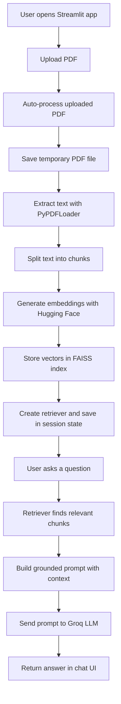
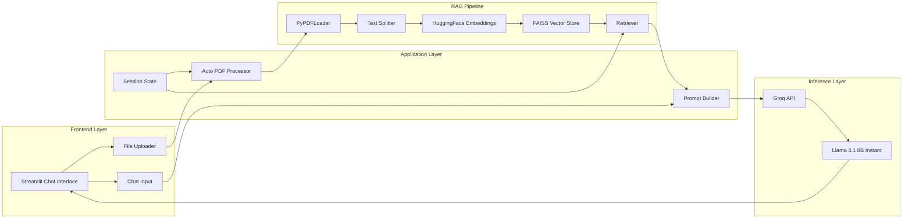
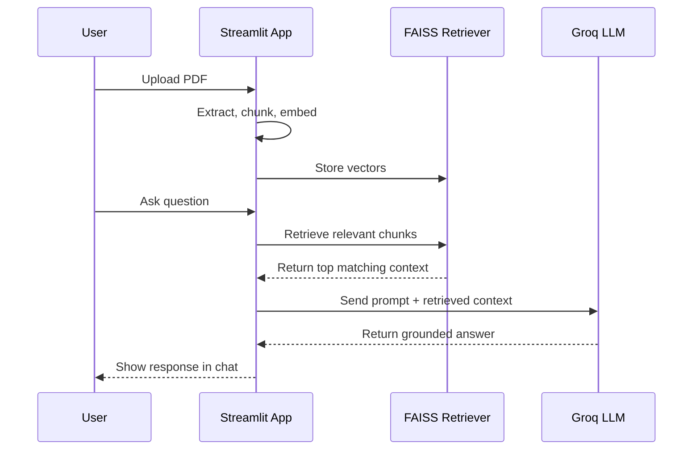
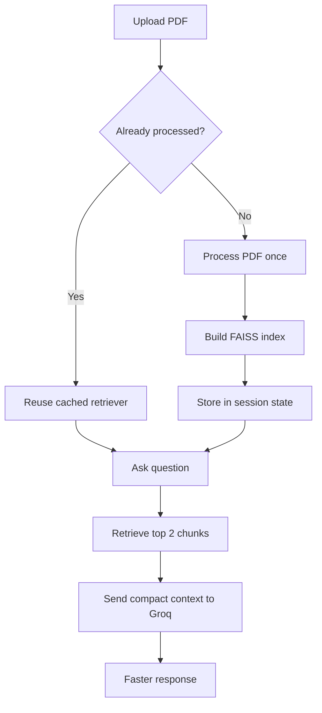

## About the App

RAG Chatbot is a fast, document-aware AI assistant that lets users upload a PDF and ask natural-language questions about its contents. The app uses a Retrieval-Augmented Generation (RAG) pipeline to retrieve the most relevant information from the uploaded document and generate grounded answers instead of relying on generic model memory.

Behind the scenes, the system automatically processes the uploaded PDF, extracts and chunks the text, converts it into embeddings, stores it in a FAISS vector index, and retrieves the best-matching context for every query. That retrieved context is then passed to a Groq-hosted LLM, enabling responses that are both relevant and low-latency.

This project demonstrates how modern GenAI systems can be built in a practical, user-friendly way using Streamlit, LangChain, Hugging Face embeddings, FAISS, and Groq inference. It is designed as both a useful document-chat application and a strong showcase of applied RAG architecture, semantic retrieval, and production-oriented AI app development.

## Workflow Diagram

## System Architecture

## Query Lifecycle

## Performance Optimization Flow

